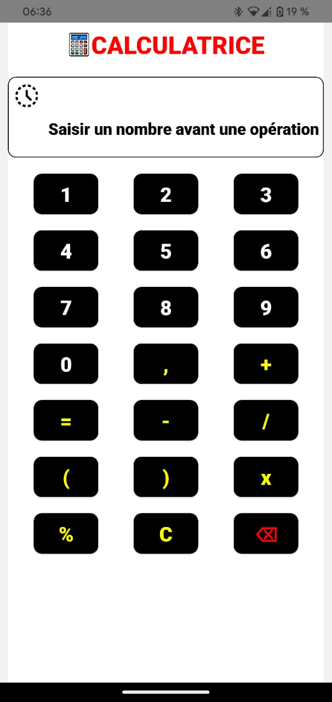
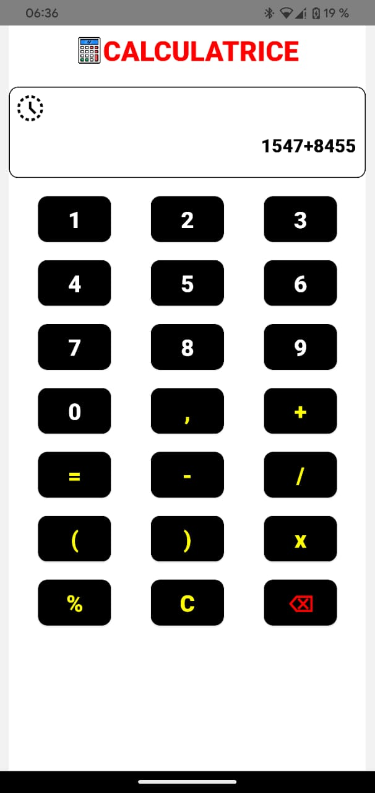

# CALCULATOR

A modern calculator mobile application built with React Native.

## Getting Started

### Installation

- Clone the repository:

```bash
git clone https://github.com/fridajoymatt/Calculaatrice.git
```

- Install dependencies:

```bash
npm install or npx expo
```

- Start the project with Expo::

```bash
expo start or npx expo start
```

## Features

- Home Screen
- History Screen

## Screenshots

|                               Screenshot 1                                | Screenshot 2 | Screenshot 3 |
| :-----------------------------------------------------------------------: | :----------: | :----------: |
| |  | 
